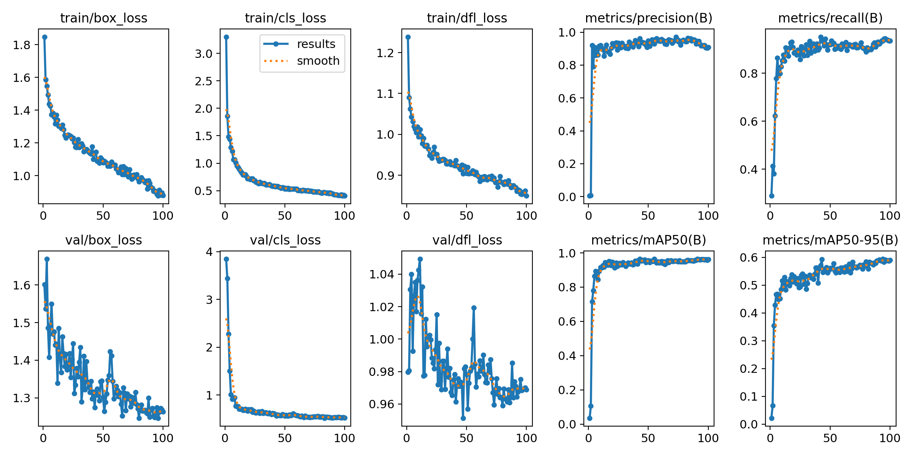
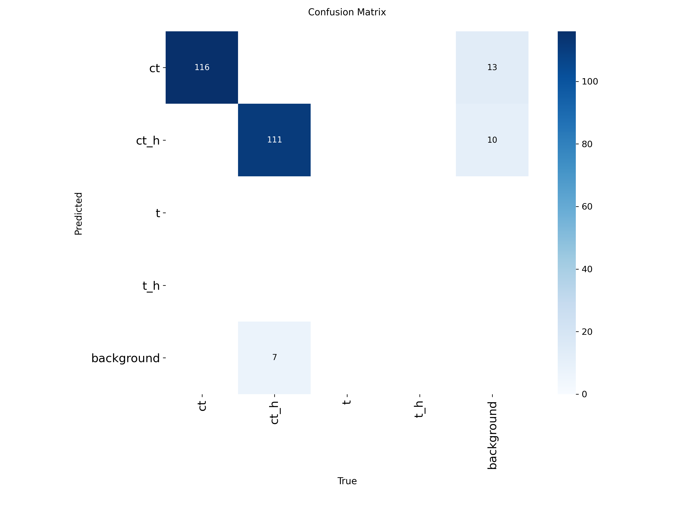

# ILoveCS — YOLO object detector for game targets 🚀🔥

Короткий шаблон `README` для проєкту з двома версіями моделей (v1, v2) та відповідними датасетами.

## Огляд

- **Мета:** детекція ігрових цілей (Counter-Strike) за допомогою YOLO.
- **Версії моделей:** `v1` (базовий набір) і `v2` (аугментації та нормалізація).
- **Головні файли:** `train.py`, `main.py`, `dataset.yaml`, `augment.py`, `dataset/noramlize.py`.

## Швидкий огляд версій

- **v1** — базова підготовка даних, чекпойнти зберігаються в `versions/v1.pt` та `runs/detect/v1/`.
- **v2** — розширений набір (аугментації + перейменування), чекпойнти в `versions/v2.pt` та `runs/detect/v2/`.

Деталі тренування збережені у `runs/detect/<name>/args.yaml` (наприклад `runs/detect/v2/args.yaml`).

## Датасет

- Шляхи в `dataset.yaml`:
  - train: `dataset/images/train`
  - val: `dataset/images/val`
- Мітки: `dataset/labels/train` та `dataset/labels/val`.
- Аугментація: запустіть `python augment.py` (вихід: `dataset/images/raw/aug`). Налаштування аугментації в `augment.py`.
- Нормалізація імен: `python dataset/noramlize.py` (налаштуйте `start_from` у файлі перед запуском).
- Зовнішній бекап зображень/лейблів (якщо потрібно): https://drive.google.com/drive/folders/1MDL5llkKT5vit44F2fvDXebbbO2LxtBi?usp=sharing

## Швидкий старт — Установлення

Рекомендується створити віртуальне середовище та встановити залежності.

```bash
python -m venv .venv
.\.venv\Scripts\activate
pip install -r requirements.txt
# або при відсутності requirements:
pip install ultralytics albumentations opencv-python pyqt5 pynput mss
```

## Тренування

За замовчуванням тренування використовує `models/yolov8n.pt` як базу — конфіг в `train.py`.

```bash
python train.py
```

Щоб запустити з кастомним ім'ям проєкту/версії:

```bash
python -c "from ultralytics import YOLO; YOLO('models/yolov8n.pt').train(data='dataset.yaml', epochs=100, imgsz=640, batch=16, project='versions', name='v2')"
```

## Інференс та Runtime

- GUI / runtime: `main.py` — налаштуйте `model_path` і `window_title` на початку файлу, потім:

```bash
python main.py
```

## Результати та метрики

- Ultralytics зберігає графіки та метрики в `runs/detect/<name>/` — відкрийте цю папку для `results.png`, `confusion_matrix.png`, тощо.
- Приклади:
  - PR-plot: `runs/detect/v2/results.png`
  - Confusion matrix: `runs/detect/v2/confusion_matrix.png`
  - Приклади детекцій: усередині `runs/detect/v2/` (зображення та підписи)

Замість локальних файлів можна додати посилання на Google Drive або розмістити скріншоти в `docs/`.

## Артефакти моделі

- `versions/v1.pt`
- `versions/v2.pt`
- Базові ваги: `models/yolov8n.pt`, `models/yolo26n.pt`

## Відтворюваність

- Параметри тренування збережено у `runs/detect/<name>/args.yaml`.
- Щоб відтворити точні результати — використайте ті самі аргументи та seed.

## Додавання результатів у README

Ви можете підставити локальні шляхи або зовнішні посилання на картинки/графіки. Приклад вставки зображення у Markdown:

```md


```

## Поради

- Змінюйте `AUG_PER_IMAGE` в `augment.py` для контролю розміру аугментованого набору.
- Робіть бекап оригінальних файлів перед перейменуванням через `dataset/noramlize.py`.
- Тримайте `dataset/images/` і `dataset/labels/` поза Git (є в `.gitignore`).

## Contributing

- Fork → branch → PR. В описі PR вказуйте, яка версія (`v1`/`v2`) і які зміни в датасеті.

---

Якщо потрібно, можу автоматично вствити приклади з `runs/detect/v2/` (зображення та метрики) — скажи «так», і я додам їх у README. 🚀
